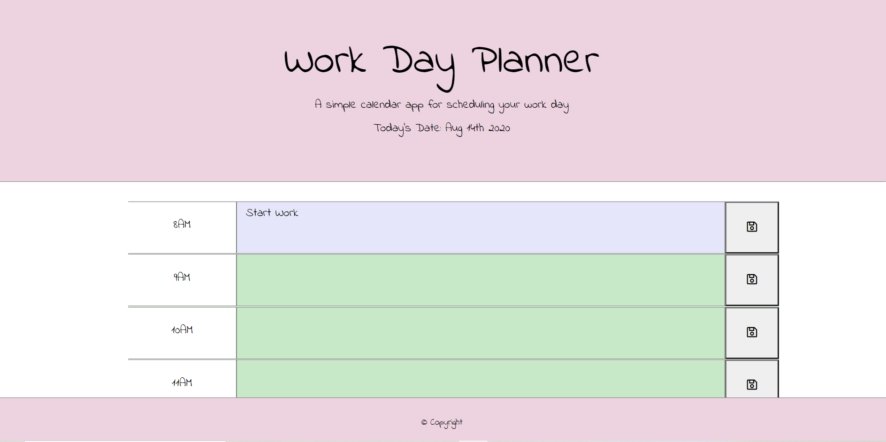
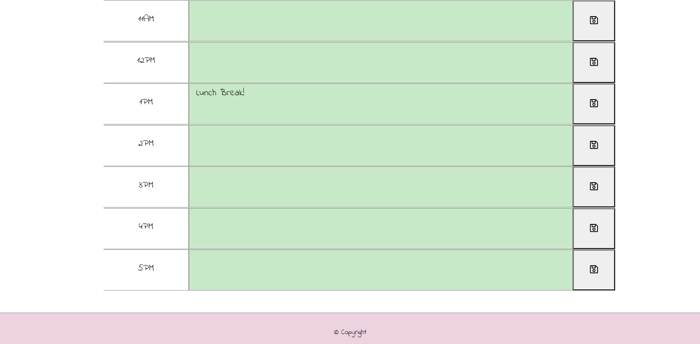

# Daily_Planner
This is a daily planner where you can schedule all your to-dos for the day!

About:

This is an interactive planner for your busy workday. 

Instructions:

Code:

This code utilizes javaScript & jQuery. The moment.js library was also used to pull in the current time and date. 

# Links

[URL of Deployed Application](https://miadehaan.github.io/Daily_Planner/)

[GitHub Repository](https://github.com/miadehaan/Daily_Planner)
